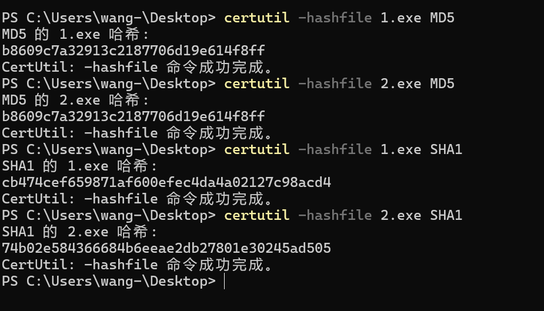

# 第 4 章 MD5散列值碰撞

计12 王嘉硕

### 实验内容
使用课程提供的 fastcoll 工具生成两个不同的文件。然后用 certutil 命令验证其 MD5 散列值相同，SHA1 散列值不同。过程如下：

```
PS C:\Users\wang-\Desktop> .\fastcoll_v1.0.0.5.exe -p C:\Windows\System32\calc.exe -o 1.exe 2.exe
MD5 collision generator v1.5
by Marc Stevens (http://www.win.tue.nl/hashclash/)

Using output filenames: '1.exe' and '2.exe'
Using prefixfile: 'C:\Windows\System32\calc.exe'
Using initial value: 0a863cd4a2d2dc2cbc34e21bd0da3538

Generating first block: ........
Generating second block: S00.............
Running time: 1.535 s
PS C:\Users\wang-\Desktop> certutil -hashfile 1.exe MD5
MD5 的 1.exe 哈希:
c20f2742485231de4c5b35526c60073b
CertUtil: -hashfile 命令成功完成。
PS C:\Users\wang-\Desktop> certutil -hashfile 2.exe MD5
MD5 的 2.exe 哈希:
c20f2742485231de4c5b35526c60073b
CertUtil: -hashfile 命令成功完成。
PS C:\Users\wang-\Desktop> certutil -hashfile 1.exe SHA1
SHA1 的 1.exe 哈希:
a1113aa001eb93468ad03c6c6016ef497920783a
CertUtil: -hashfile 命令成功完成。
PS C:\Users\wang-\Desktop> certutil -hashfile 2.exe SHA1
SHA1 的 2.exe 哈希:
704ee88fd946f7a5e941ebe51d3f5c0a5dcc0d7a
CertUtil: -hashfile 命令成功完成。
```

可见，两个文件的 MD5 散列值相同但 SHA1 散列值不同。截图如下：
!!
