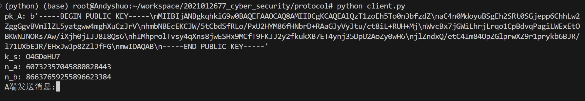

# 第 4 章 基于口令的身份验证协议

计12 王嘉硕

### 环境设置
```
Python 3.8.17

Name: pycryptodome
Version: 3.20.0
```

### 实验内容

双方共享口令，代码中设置为"sharekey"。每一步的验证过程参照教材P151实现即可：

- 第一步，Client 端生成 RSA 密钥对，将公钥用口令 DES 加密后发给 Server（由于仅有两个进程在通信，故忽略身份标识）。
- 第二步，Server 端用口令 DES 解密 Client 发来的公钥，生成会话密钥，用公钥 RSA 加密会话密钥，再用口令再次 DES 加密，发送给Client。
- 第三步，Client 端收到 Server 端的会话密钥，生成随机数 NA，用会话密钥对随机数 DES 加密后发给 Server。
- 第四步，Server 端收到 Client 端的随机数 NA，生成随机数 NB 后将二者拼接，用会话密钥 DES 加密后发给 Client。
- 第五步，Client 端收到 Server 端的两个随机数 N1||N2，验证 N1 是否等于 NA。如果相等，将 N2 用会话密钥 DES 加密后发给 Server。
- 第六步，Server 端收到 Client 端的随机数 N2，验证 N2 是否等于 NB，如果相等则验证通过，开始互相发送消息。

如上所述，为简便起见，本实验中对称加密全部使用了 DES 而未使用 AES，不过原理是相同的。

### 实验结果

我们启动两个终端，一个运行`python server.py `，另一个运行`python client.py`，在验证通过后即可开始互相发送消息：

Server 端：
```
认证成功
B端接收消息 1
B端发送消息:33
```

Client 端：
```
认证成功
A端发送消息:1
A端接收消息 33
```

我们也可以打印会话密钥、随机数来确认验证过程的正确性（此处将后续的互发消息省略掉）：
Server 端：
```
pk_A: b'-----BEGIN PUBLIC KEY-----\nMIIBIjANBgkqhkiG9w0BAQEFAAOCAQ8AMIIBCgKCAQEAvoI/GEkyzBeSJdBQduLj\nNsbHMGyFmLBP2/RY/mMEZU393tzJCD12ShqEklU8vlyqAXJrd6o2mDHEXF6VxKxX\nqavvt36quohhh4oDTvYeZfCFiBBMtTu/xSxoF4ZY05COEB+V2KuvqEDEuYsCGMd5\nwadqwFk99fqHRPeZ5y2EKaJF6pOICf/NqkY+nXxRe6jN7OJsx5J5XBJEfrRgOYmW\nyIeqgPLSv685nH9+4Tfbh+vkLJHFUw5RLgpTyx7/7b3oZ1nSERtOUPvbRhcJ/xBl\nPxpMTHK6jCGwZIJ54zGjkUL0oxaS6a/qUaZx+OGTtG0wasRom3FoFFPTtTvle7v5\n/wIDAQAB\n-----END PUBLIC KEY-----'
k_s: 5n98HKim
n_a: 80809356926247789185
n_b: 00293299610081228749
```

Client 端：
```
pk_A: b'-----BEGIN PUBLIC KEY-----\nMIIBIjANBgkqhkiG9w0BAQEFAAOCAQ8AMIIBCgKCAQEAvoI/GEkyzBeSJdBQduLj\nNsbHMGyFmLBP2/RY/mMEZU393tzJCD12ShqEklU8vlyqAXJrd6o2mDHEXF6VxKxX\nqavvt36quohhh4oDTvYeZfCFiBBMtTu/xSxoF4ZY05COEB+V2KuvqEDEuYsCGMd5\nwadqwFk99fqHRPeZ5y2EKaJF6pOICf/NqkY+nXxRe6jN7OJsx5J5XBJEfrRgOYmW\nyIeqgPLSv685nH9+4Tfbh+vkLJHFUw5RLgpTyx7/7b3oZ1nSERtOUPvbRhcJ/xBl\nPxpMTHK6jCGwZIJ54zGjkUL0oxaS6a/qUaZx+OGTtG0wasRom3FoFFPTtTvle7v5\n/wIDAQAB\n-----END PUBLIC KEY-----'
k_s: 5n98HKim
n_a: 80809356926247789185
n_b: 00293299610081228749
```

截图如下：
!!