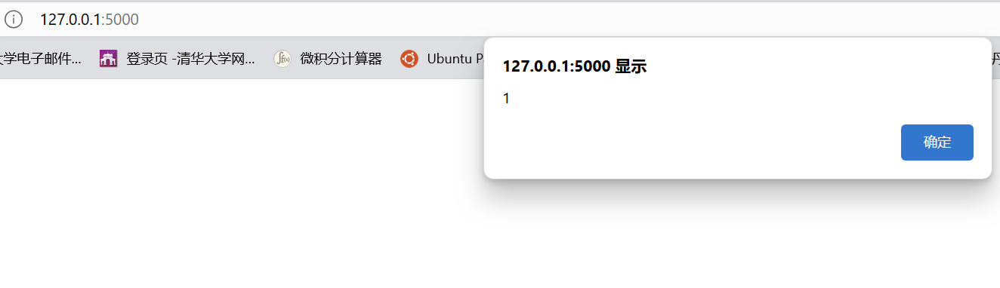
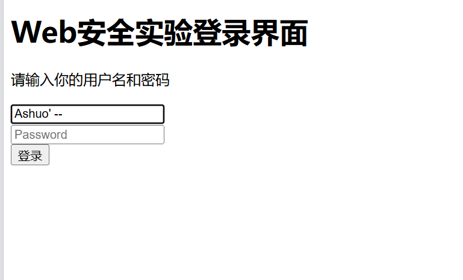
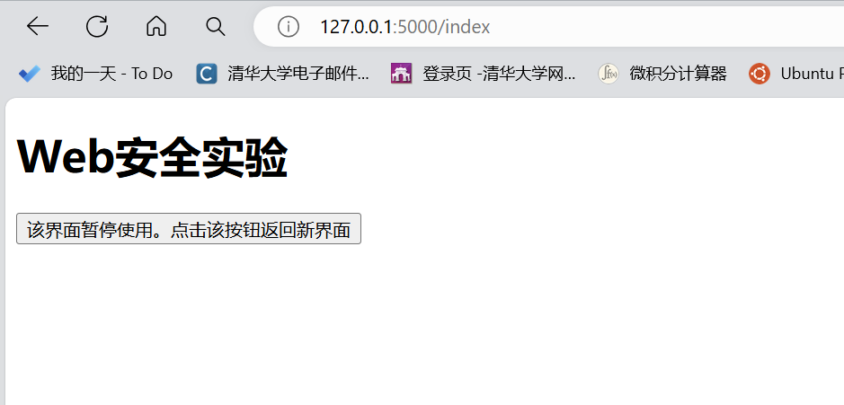
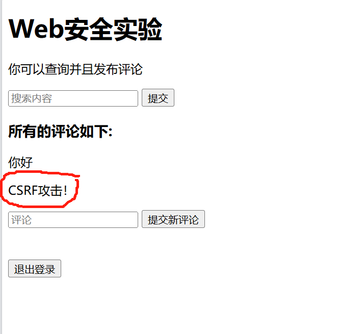

# 第 13 章 常见Web漏洞演示 

计12 王嘉硕

### 环境设置
```
Python 3.8.17

Name: Flask
Version: 3.0.3
```

### 1. 尝试使用防御方法，防范XSS攻击。

XSS 攻击是指通过存在安全漏洞的Web网站注册用户的浏览器内运行非法的HTML。

在本代码中，添加内容为“`<script>alert('1')</script>`”的评论则会导致每次进入该界面都会弹窗。由于该评论被写入数据库，所以每次进入该界面都会被 HTML 解析并如图所示触发弹窗：


防御方法是对搜索内容和评论内容进行转义即可。代码如下：
```
if PROTECT_XSS:
    if search_query is not None:
        search_query = escape(search_query)
    comments = [escape(comment) for comment in comments]
```

在进行转义后，即使输入了“`<script>alert('1')</script>`”也不会触发弹窗。

### 2. 增加一个登陆功能，设计有SQL注入隐患的代码，进行攻击。并且展示如何进行防范。

我们用 session 机制来增设登录功能。用户在未登录时访问“http://127.0.0.1:5000/”时会强制跳转到“http://127.0.0.1:5000/login”。用户在登录界面输入用户名和密码后，如果用户名和密码正确则会跳转回原界面，否则会被要求重新输入密码。

登录功能的实现代码如下：
```
# 登录
@app.route('/login', methods=['GET', 'POST'])
def login():
    if request.method == 'POST':
        username = request.form.get('username')
        password = request.form.get('password')
        
        db = connect_db()
        # TODO：为了防止 SQL 攻击，我们不能简单地拼接字符串。将此处变为 Flase 即可重新进行 SQL 注入攻击
        if PROTECT_SQL:
            user = db.cursor().execute('SELECT username FROM users WHERE username=? AND password=?', (username, password)).fetchone()
        else:    
            user = db.cursor().execute('SELECT username FROM users WHERE username=\'{}\' AND password=\'{}\''.format(username, password)).fetchone()
            
        if user:
            session_id = os.urandom(16).hex()
            csrf_token = os.urandom(16).hex()
            db.cursor().execute('INSERT INTO sessions (username, session_id, csrf_token) VALUES (?, ?, ?)', (username, session_id, csrf_token))
            db.commit()
            res = redirect(url_for('index'))
            res.set_cookie('session', session_id)
            return res
        else:
            return render_template('login.html')
    else:
        return render_template('login.html')
    
# 注销
@app.route('/logout', methods=['POST'])
def logout():
    res = redirect(url_for('login'))

    # delete session
    session_id = request.cookies.get('session')
    db = connect_db()
    db.cursor().execute('DELETE FROM sessions WHERE session_id=?', (session_id,))
    db.commit()

    res.set_cookie('session', '', expires=0)
    return res
```

SQL 注入攻击是指 web 应用程序对用户输入数据的合法性没有判断或过滤不严，导致攻击者可以在 web 应用程序中事先定义好的查询语句的结尾上添加额外的 SQL 语句。

在本代码中，如果我们不注意 SQL 注入隐患，简单地使用字符串拼接的方式进行 SQL 查询，那么我们可以简单地使用“`username' --`”即可无需密码的情况下登录成功。假设我们提前设置一个用户名为“Ashuo”、密码为“123456”的用户，那么我们可以用“Ashuo' --”这个用户名即可无需密码登录该用户。登录方式如图所示：


防御方法是不再使用字符串拼接的方式进行 SQL 查询，而是使用参数化查询。代码如下：
```
if PROTECT_SQL:
    user = db.cursor().execute('SELECT username FROM users WHERE username=? AND password=?', (username, password)).fetchone()
else:    
    user = db.cursor().execute('SELECT username FROM users WHERE username=\'{}\' AND password=\'{}\''.format(username, password)).fetchone()
```

### 3. 设计一个CSRF攻击范例，并且演示如何防御。

CSRF 攻击是指攻击者诱使被攻击者打开一个链接，利用用户已登录的身份以用户的名义完成非法操作。

在本代码中，我仿制了一个链接为“http://127.0.0.1:5000/index”的非法链接，以诱导用户以为这是一个曾用的合法链接。在登录状态下的用户点进这个链接后网页会诱导用户点击“该界面暂停使用。点击该按钮返回新界面”按钮。点击后用户确实能返回原网页，但同时会在不知情的情况下以自己的名义发表一条“CSRF攻击！”的评论。具体代码如下：
```
@app.route('/index', methods=['GET', 'POST'])
def csfr():
    if request.method == 'POST':
        add_comment(request.form['comment'])
        return render_template('index.html')
    else:
        return render_template('csrf.html')
```

非法链接界面如图所示：

在点击按钮返回正常界面后，会发现自己被迫发了一条内容为“CSRF攻击！”的评论：



防御方法是在表单中添加一个隐藏的随机 token，每次提交表单时都会验证 token 是否正确。而非法链接在不知道这个 token 的情况下无法实现非法操作。代码如下：
```
session_id = request.cookies.get('session')
csrf_token = request.form.get('csrf_token')
db = connect_db()
token = db.cursor().execute('SELECT csrf_token FROM sessions WHERE session_id=?', (session_id,)).fetchone()

if PROTECT_CSRF:
    if token == csrf_token:
        db.cursor().execute('INSERT INTO comments (comment) '
                            'VALUES (?)', (comment,))
        db.commit()
else:
    db.cursor().execute('INSERT INTO comments (comment) '
                        'VALUES (?)', (comment,))
    db.commit()
```     